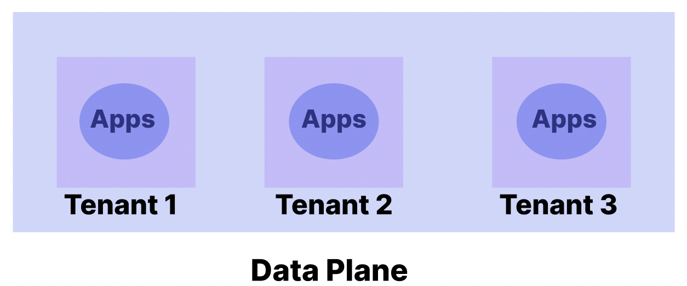
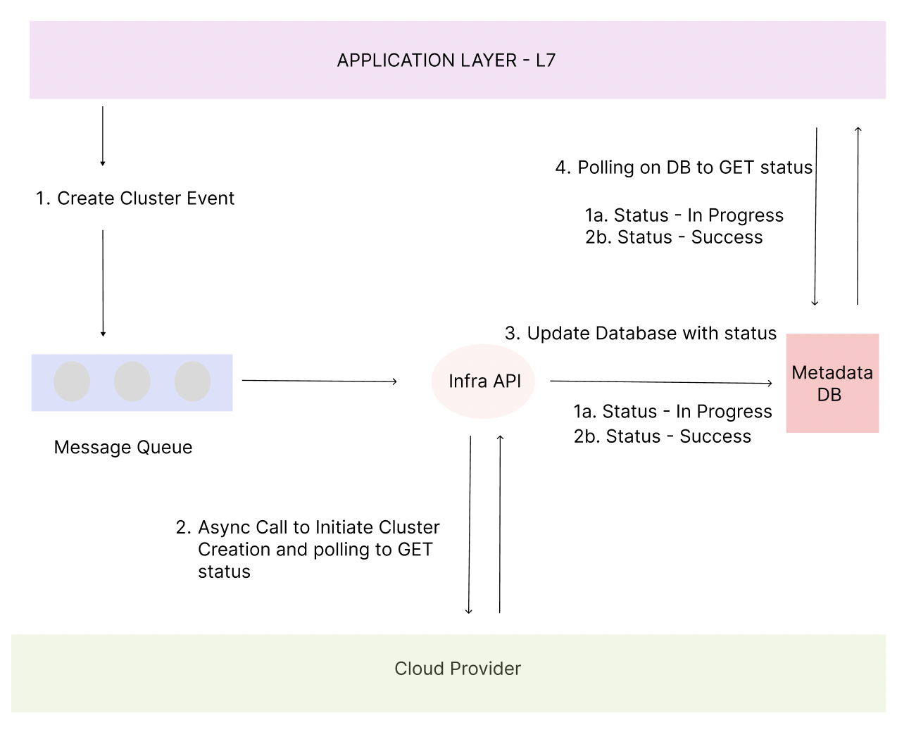
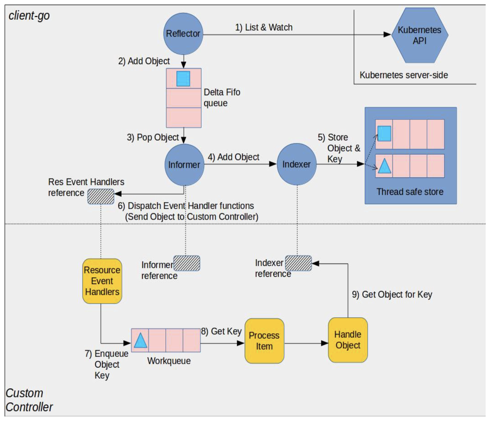

*In our previous post, "[Centralised Control Planes for SaaS - Part 1](https://www.datainfra.io/blog/centralised-control-planes-for-saas-infra-part-1)," we delved into the world of SaaS business models and the challenges that arise when constructing a centralised control plane. In this instalment, we will take a closer look at the crucial first step in building a control plane: the design of an asynchronous event handling system. This system plays a pivotal role in creating infrastructure, managing tenants, and deploying applications within a SaaS environment. Moreover, we will explore two distinct schools of thoughts : application developer versus infrastructure developer.*

## Introduction

In the realm of SaaS, the control plane serves as an orchestrator of fundamental operations. Our focus here lies specifically within the [service provisioning layer](https://www.datainfra.io/blog/centralised-control-planes-for-saas-infra-part-1#service-provisioning-layer). This layer enables the control plane to execute CRUD operations on various entities. Let's break down these operations:

<!--truncate-->

### Data Planes
Think of these as the Kubernetes Clusters within the SaaS provider's network or even the customer's own network. The control plane are responsible for triggering CRUD functions. The data planes are where the SaaS applications are deployed.

### Tenants
Tenants refer to the entities that encapsulate customer applications. These can range from fully isolated physical machines to logically separated deployments within a network, safeguarded by network policies. The concept of tenancy adapts to the diverse array of SaaS business models. Tenants are a part of a data plane.

### Applications
The life cycle of applications is another critical aspect managed by the control plane. These applications can be scoped to a specific tenant or a data plane. Control plane does not solve issues of configuration management, it expects the application to be bundled in a specific format, its only responsible for deploying the app.

#### Correlation Between DataPlanes , Tenants and Apps

-------------------------------------------------------------------------------------------

### Analytics: Metrics, Events, and Monitoring

Every SaaS control plane needs to be able to support relevant analytics across various data planes, tenants and applications deployed. It's crucial to clarify that our scope centres on analytics pertinent to the control plane, with a clear distinction from application-specific analytics.

### Billing

Billing strategies catering to the unique needs of both providers and consumers. These strategies can range from usage-based metrics, where costs are tethered to actual consumption, to subscription-based models, offering a predictable payment structure.

:::info
In our next blog, we shall dive deep into elevating SaaS Control Planes with targeted analytics and various billing models.
:::

## The Event-Driven Paradigm
At the heart of our control plane lies an event-driven system. Each request to perform a CRUD operation on the various entities translates into an event. This event inherently carries a specific – your desired outcome as a user. The prowess of a control plane is demonstrated when it effectively responds to these events, steering the system towards reconciling the intended or the desired state with the current state.

:::info
 We have witnessed an intriguing contrast between application and infrastructure developers in event-driven architecture, while application developers often integrate event handlers at the API level, infrastructure developers tend to favour state machines at the infrastructure level. As a developer designing a system, do you see your infrastructure as a control plane for your application ? If yes, can you react to events at the infra level ?
:::

## The Stateful Control Plane - Application Developer
App developers prefer events and event handlers within the application or Layer 7 of the OSI model. Designing APIs to control the system's state, relying on robust worker queues like Kafka to construct control planes. Here's how it unfolds:

- **Event Triggering and Persistence**:              
Events originating from the Application Layer (UI) are pushed into a queue. For instance, a "**CREATE CLUSTER**" event is pushed in the queue. The API layer changes the "**STATUS**" in the metadata DB to "**CREATING**".

- **Infra API Triggering**:                   
An Infra API consumes the **CREATE CLUSTER** event and calls an Aysnc API on the cloud to provision a cluster. Cloud Provider's API to create cluster is async, so the Infra API polls to GET status, once received a response it updates the metadata DB with the status.

- **Worker Queues**:            
As the system scales, events are funnelled into a worker queue to ensure consistency and prevent event loss.

- **Database Polling**:
Database used to store the **STATE** an event occured. Database is often polled by the API's to GET status.

- 
:::note
This diagram displays a high level stateful control plane approach. Here infrastructure where SaaS control plane API's are deployed is merely an orchestration platform.
:::

-------------------------------------------------------------------------------------------
### Challenges of Stateful Control Planes
However, this approach comes with some challenges:

- **Dependency on Databases and Worker Queues**:     
The architecture relies on databases and worker queues for driving state transitions. Purely driven by API's.

- **Error-Prone Development and Testing**:                     
Constructing and testing this architecture can be error-prone and time-consuming, hampering development speed. Async APIs and continuous polling often lead to performance bottlenecks and are complex to scale and maintain.
- **Decoupling Limitations**:      
As emphasised in our previous blog, decoupling API layers from the service provisioning layer is crucial. Yet, the stateful control plane's dependencies can hinder full decoupling. This limitation becomes apparent, especially in scenarios like private or hybrid SaaS, where running the control plane on customer premises is desired.
- **Private SaaS**:            
Consider an enterprise customer who wishes to utilise your SaaS solution but requires deployment within their network due to data sharing constraints. If your SaaS architecture is decoupled, you can deploy the control plane to the customer's network while retaining your application layer. Contrast this with a stateful control plane – you would need to ship databases, worker queues, and a suite of APIs.

## The Stateless Control Plane - Infrastructure Developer

As an infrastructure developer, the control plane becomes an integral part of your infrastructure. Kubernetes transcends mere orchestration; it serves as the control plane for your applications. Let's explore how we can harness our infrastructure to create an event-driven SaaS control plane—one that is inherently stateless.

### State Machines But Not Rigid

Let's delve into some key concepts surrounding state management at the infrastructure level.

SaaS control planes are intimately connected with managing various states. These states undergo frequent transitions, where events progress from ***CREATE*** to ***IN-PROGRESS*** and finally to ***SUCCESS***.

When grappling with state-related challenges, it becomes evident that there are three distinct types of state:

- ***Current State***
- ***Desired State***
- ***Original State***

While using APIs to manipulate state may appear to be a straightforward approach, it falls short in truly addressing the intricacies of state management. State machines are rigid ie they have hardcoded state in built for certain outcomes.Moreover like a switch ON and OFF.

In Kubernetes, controllers rely on conditions—essentially orthogonal concepts. These controllers fabricate state by observing changes, constructing the evolving state during each reconciliation process. While Kubernetes controllers possess certain traits akin to state machines, they are far from rigid. Interestingly, the term "state machine" is notably absent from the Kubernetes documentation.

### Stateless Event-Driven Paradigm of Kubernetes Controllers

Kubernetes maintains its state within ETCD. Every time you apply a manifest, an event is triggered. Your task is to construct event handlers tailored to these occurrences, with Kubernetes handling the persistence aspect seamlessly.

Events embody a dual-trigger approach:

- **Edge-Driven Trigger**
Whenever a state alteration transpires within the Custom Resource, it promptly activates a corresponding handler. This event is then relayed to a worker queue, where it undergoes dequeuing and is ultimately reconciled by the reconciler.

- **Level-Driven Trigger**
At regular intervals, a comprehensive state assessment is conducted. If the existing state fails to align with the desired state—taking into account the original state—the event handler is triggered to take corrective measures.

:::info
This original diagram can be found [here](https://github.com/kubernetes/sample-controller/blob/master/docs/controller-client-go.md). This diagram shows how to build an event driven system leveraging Kubernetes API's.
:::

### Next-Gen SaaS: The Kubernetes Control Plane Advantage

***Efficient ETCD Utilization***:                 
Kubernetes' utilization of ETCD for state storage simplifies event triggering and state management, enhancing overall system efficiency.

***Dynamic State Assessment***:                  
The level-driven trigger ensures periodic state assessments, allowing the control plane to promptly detect and correct any deviations from the desired state.

***Community Support and Libraries***:                           
Open source libraries [operator-runtime](https://github.com/datainfrahq/operator-runtime) and [controller-runtime](https://github.com/kubernetes-sigs/controller-runtime) have abstracted out the complexity of the Kubernetes API and helping users focus embedding application logic into Kubernetes.

***Private SaaS***:                
To run your SaaS on customer network, you can easily ship your Custom Resources spec and run the control plane for SaaS, what you really need is just a Kubernetes Cluster.

***Utilizing Custom Resource Status for Effective Controller State Management***:              
Kubernetes controllers have traditionally adhered to a stateless paradigm. However, as system complexities grow, the maintenance of complete statelessness can pose challenges. To overcome these challenges, controllers can strategically harness the power of Status fields, inherent within every Kubernetes object.

## Summary                  
Beyond being a mere orchestrator, Kubernetes emerges as the comprehensive control plane for applications. In this dynamic landscape, the marriage of Kubernetes controllers with the stateless, event-driven paradigm ushers in a new era of infrastructure development for the SaaS control plane. 
If you are building a SaaS, and want to build a stateless control plane, feel free to get [connected](https://www.datainfra.io/) with us.
