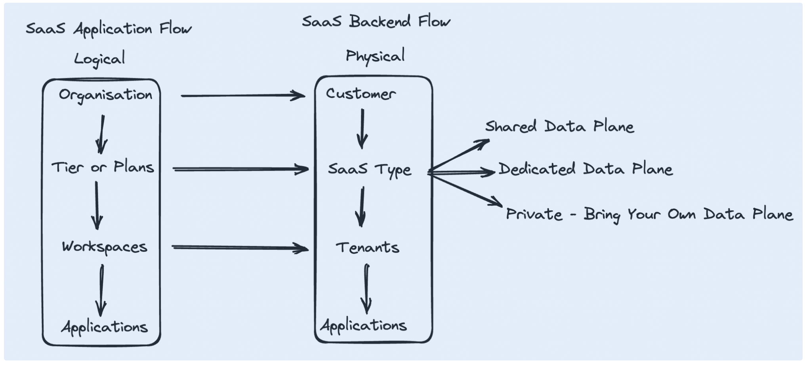
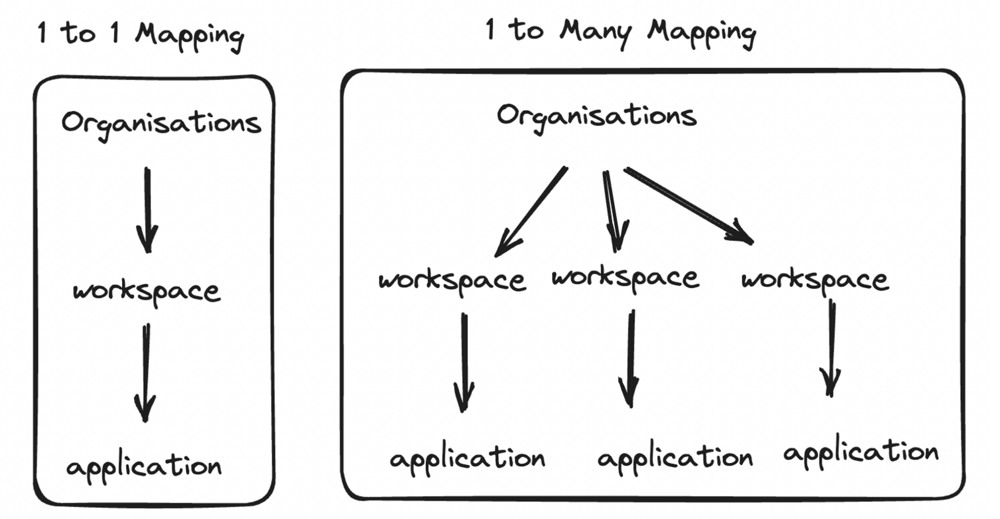
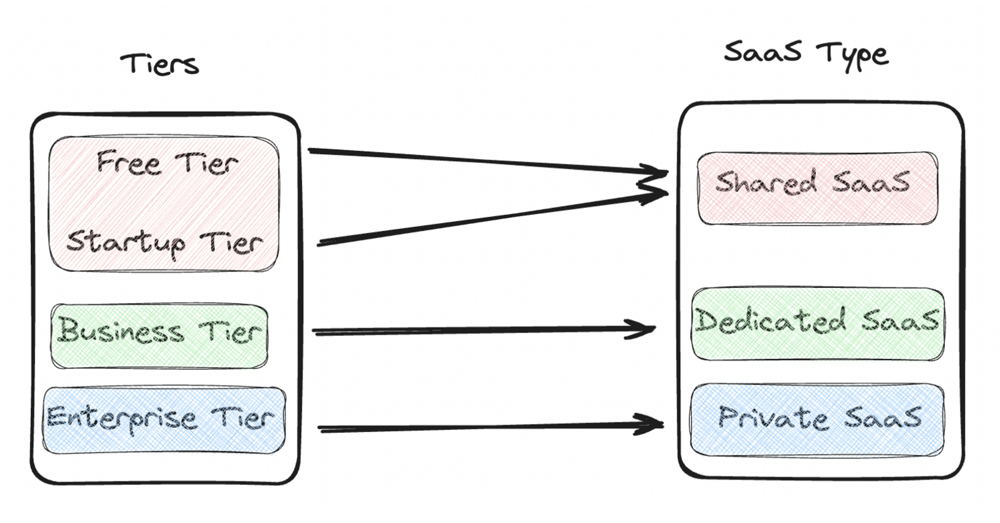
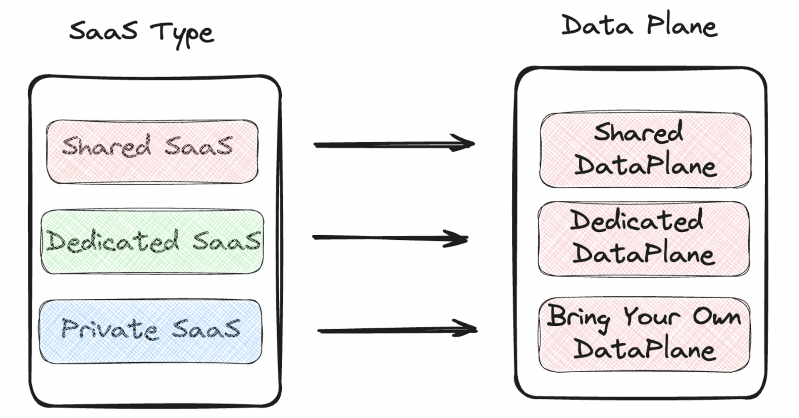
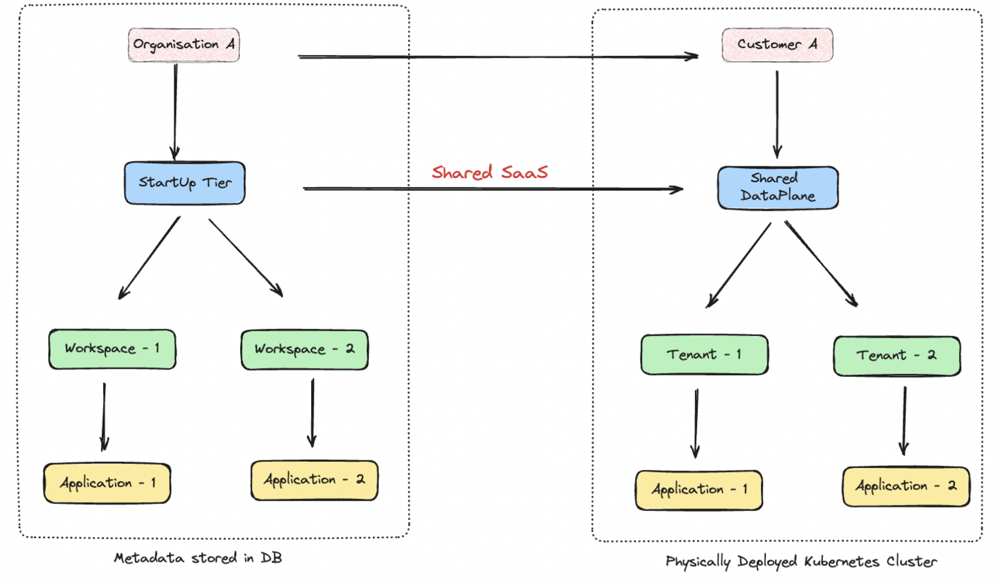

*In our previous post, "[Centralised Control Planes for SaaS - Part 2](https://www.datainfra.io/blog/centralised-control-planes-for-saas-infra-part-2)," we discussed about the approaches to build a stateless control plane and how to handle async communication b/w the data planes and cloud provider. In this instalment we take dive into the physical and logical models in a SaaS control planes.*

## Introduction

As we build a robust SaaS architecture understanding of logical and physical mappings is essential. These mappings serve as tools in aiding SaaS developers in the translation of user-facing processes into corresponding SaaS backend workflows.

## Logical Model and Physical Model

The logical model encompasses metadata pertaining to various aspects of the system:

- **Organisations:** Every user using the SaaS platform belongs to an organisation. Organisation is a customer for the SaaS provider.
- **Tiers or Plans:** The different levels of service or subscription plans offered to users.     
- **Workspaces:** Dedicated spaces for users to collaborate and deploy applications.            
- **Applications:** Software applications and services provided within the SaaS framework.

This metadata is stored in metadata DB. It is important to note that for each logical entity, there exists a corresponding physical entity in the system.

-------------------------------------------------------------------------------------------

The physical model, deals with the tangible, real-world bindings to the underlying infrastructure that supports the SaaS architecture. These physical include:

- **Customer:** A customer is an organisation.
- **Data Planes:** Data Planes are where the software is deployed. They can be in the SaaS provider network or in the customer network.
- **Tenants:** Segregated sections or environments within the architecture, often employed for multi-tenancy support.
- **Applications:** Application denotes the SaaS provider's application.

:::note
This diagram displays mapping between the logical and physical terminologies.
:::

-------------------------------------------------------------------------------------------

## Relationship Model

Here we understand the relation between each of the components described within the logical and physical model.

###  Organisation, Workspace and Applications ( Logical )

- Organisation onboarded is a customer for the SaaS Provider.
- Organisation can consists of a single workspace or multiple workspace.

-------------------------------------------------------------------------------------------

### Tiers or Plans and SaaS Types ( Logical to Physical )

- A Tier or Plan is offered by the SaaS provider.
- Each Tier or Plan has a quota limit on the usage of the SaaS product.
- Organisation onboarded have a SaaS Tier associated with them.
- Each tier is mapped to a SaaS Type.

-------------------------------------------------------------------------------------------

### SaaS Types and Data Planes ( Conceptual to Physical )

- Each SaaS Type is mapped to a data plane.
:::note
SaaS Type is a conceptual model. Each SaaS Type has a physical mapping ie data planes. Data Planes as an abstraction consist of network, storage and kubernetes.
:::

-------------------------------------------------------------------------------------------

### End to End Mapping between Logical and Physical Models

- The logical entities is metadata stored in the database.
- For each entity stored a physical entity is created. 

-------------------------------------------------------------------------------------------

## Summary

SaaS architecture relies on logical and physical models. These models aid developers in bridging user processes with backend workflows.
If you are building a SaaS, and want to build a control plane, feel free to get [connected](https://www.datainfra.io/) with us.
