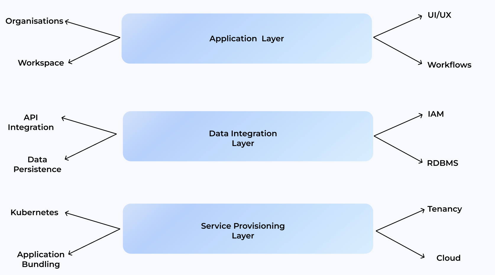
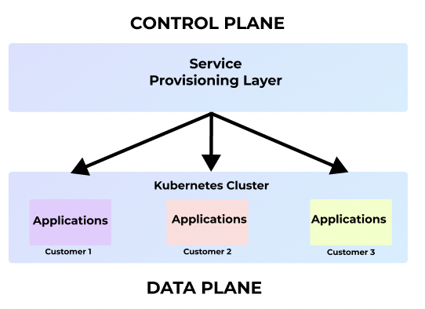
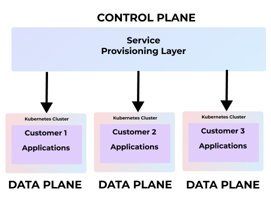
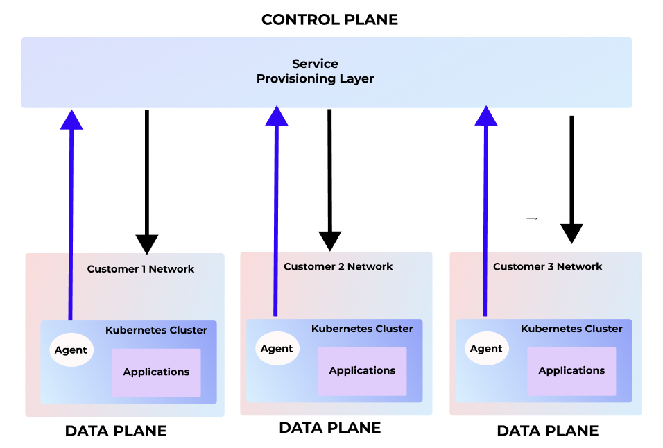

*For a couple of years, my journey has revolved around constructing control planes for data infrastructure startups. As an engineer I have been fortunate to gained invaluable insights into the challenges and intricacies of developing successful SAAS products. Drawing from my firsthand experiences, this series of blog post's delves into the lessons learned and shares my goals at DataInfra, where I am building centralised control plane for SAAS infrastructure. Join me as we explore the critical aspects and key considerations of constructing effective control planes in the dynamic and competitive SAAS industry.*

# Introduction

Before we delve into the content, let's address the ambiguity surrounding the term **"Control Plane for SAAS Infrastructure."** In the context of SAAS infrastructure, the control plane refers to the centralised system that governs and orchestrates the deployment, configuration, and operation of applications and services on data planes.
Data Planes can exist within the SAAS providers network or at the customer premise.
By SAAS Infra, I specifically mean the service provisioning layer in a SAAS product.

## SAAS Architecture Layers

Let's discuss a high level approach of SAAS architecture layers.

<!--truncate-->

### Application Layer:
The application layer encompasses the UI/UX design, onboarding workflows, and user management aspects. This layer focuses on delivering a seamless user experience, tailored to the unique requirements of each application. Workflows can define mapping of a single orgranisations to a workspace or multiple workspaces.

### Data Integeration Layer:

The data integration layer handles tasks such as data persistence to relational databases, authentication mechanisms, and data-related operations. It ensures efficient data management and integration and acts as a middleware. 

### Service Provisioning Layer:

The service provisioning layer is responsible for managing the lifecycle of applications deployed to data planes and most of cases it is also responsible for lifecycle of data planes. It involves tasks like application deployment, scaling, monitoring, and health checks.

*As we delve deeper we are focused on the service provisioning layer. The service provisioning layer should always be decoupled from the App and DI layers. This layer can be ported to any cloud on any network.*

## SAAS Buisness Models

Organisations have the flexibility to adopt various SaaS deployment models based on their requirements and customer expectations. Here are three major models:

### Shared SAAS
:::note
This diagram shows a single kubernetes clusters where each customer has its own logical namespace where applications are deployed. Here we can also assume that the underlying Infra creation is a one time operation. In such cases, two customer pods can run on the same kubernetes nodes. So isolation is at the logical level only.
:::

-----------------------------------------------------------------------------------------------

-----------------------------------------------------------------------------------------------

- **Infrastructure:** Shared Compute and Network, with no data isolation guarantees.
- **Complexity:** Easy to build, faster upgrade cycles, and simple management.
- **Cost:** Lower cloud costs.
- **Deployment Tier:** Free Tier or lower-cost options.
- **Design Pattern:** Push Based
- **End Users:** Potential buyers, primarily exploring the product and acting as playground users.

### Dedicated SAAS
:::note
This diagram shows mutiple kubernetes clusters where each customer has its own dedicated kubernetes cluster where applications are deployed. Here we also assume that the underlying network infra is isolated ie each k8s cluster has its own VPC and the service provisioning layer is responsible for creating this. The underlying data planes ( k8s cluster) are within the SAAS providers network.
:::

-----------------------------------------------------------------------------------------------

-----------------------------------------------------------------------------------------------

- **Infrastructure:** Separate Compute and Network, guaranteeing data isolation.
- **Complexity:** Moderate development complexity, slower upgrade cycles, and increased management challenges at scale.
- **Cost:** Higher cloud costs.
- **Deployment Tier:** Higher-priced tiers.
- **Design Pattern:** Push Based
- **End Users:** Buyers who trust the SAAS platform and are willing to share their data.

### BYOC ( Bring Your Own Cloud ) SAAS
:::note
This diagram shows mutiple kubernetes clusters where each customer has its own kubernetes clusters where applications are deployed but here the data planes are on the customer network. 
The service provisioning layer creates the infra and deploys agents, which pull configs and deploy applications on the cluster.
:::

-----------------------------------------------------------------------------------------------

-----------------------------------------------------------------------------------------------

- **Infrastructure:** Separate Compute and Network, guaranteeing data isolation. Increased complexity around security and access of agents.
- **Complexity:** High complexity, very slow upgrade cycles, and secure access requirements to customer networks.
- **Cost:** In most cases, customers bear the cloud costs, but SAAS providers are accountable for cost visibility.
- **Design Pattern:** Push Based and Pull Based.
- **Deployment Tier:** Advanced or enterprise tiers.
- **End Users:** Buyers who trust the SAAS application and prioritise data privacy.

## Problem Statements

### Achieving a Centralized Control Plane Design for SAAS Infrastructure Supporting All Business Models

The challenge lies in creating a centralized control plane system that effectively caters to the diverse needs of SAAS providers, accommodating the three major business models: Shared, Dedicated, and BYOC SAAS. The objective is to design a control plane that seamlessly handles the unique requirements of each model while ensuring optimal performance and customer satisfaction.

### Establishing Comprehensive Mutli Tenancy and Data Isolation in SAAS Infrastructures

In shared and dedicated SAAS environments, it is crucial to go beyond mere logical isolation and establish both physical and logical isolation at the infrastructure level. The aim is to overcome the limitations of purely logical tenancy, ensuring robust data security, privacy, and enhanced customer trust.

### Efficient Lifecycle Management of Infrastructure and Applications

To streamline operations, it is essential to design a control plane capable of effectively managing two critical abstractions: infrastructure and application. The challenge is to ensure seamless coordination and orchestration between these abstractions to optimize the lifecycle management of network, storage, compute resources, and applications.

### Addressing Governance Challenges in SAAS Control Plane

To enhance governance in SAAS environments, certain crucial questions need resolution:

- Determining the responsible party for applying configurations
- Identifying the entity accountable for reconciling configurations
- Establishing the appropriate ownership for maintaining the desired state, current state, and original state. 

Finding solutions to these questions will enhance governance practices and ensure consistency and compliance in the control plane.

### Enabling Cost Calculation per Tenant in a Hybrid SAAS Billing Model

The challenge lies in developing a control plane that can accurately calculate costs per tenant in a SAAS billing model that combines both usage-based and subscription-based approaches. By providing transparency and visibility into costs, this solution will enable fair billing practices and facilitate better financial management for both SAAS providers and their customers.

### Designing a Lightweight Stateless Control Plane for Event Handling in SAAS Platforms

Creating a lightweight, stateless control plane capable of efficiently handling events at scale is crucial in SAAS platforms. The objective is to address challenges such as preventing cluster creation from entering unknown states or missing critical events. This solution aims to ensure smooth event processing without relying on resource-intensive message queues or persisting events in databases.

### Streamlining Application Bundling and Scope Definition in Data Plane Deployments

Simplifying the process of bundling applications with logging platforms, monitoring agents, and network proxies during their deployment to data planes is a key challenge. Additionally, defining the scope of applications deployed becomes essential for effective resource utilization and optimized performance. The goal is to develop streamlined approaches for application bundling and scope definition to enhance deployment efficiency and ease of management in SAAS infrastructures.

## Summary

This blog post provides insights into building centralized control planes for SAAS infrastructure. It discusses the layers of SAAS architecture and explores three major SAAS business models: Shared SAAS, Dedicated SAAS, and BYOC (Bring Your Own Cloud) SAAS. The post highlights various problem statements, including achieving physical and logical isolation, efficient resource and application lifecycle management, governance, cost calculation, event handling, and application bundling. It serves as a valuable resource for SAAS infrastructure builders and stakeholders.

In the next blog i will cover how we are solving these problems with our product.    
If these problem statements look familar to you, feel free to get [connected](https://datainfra.io) with us.
