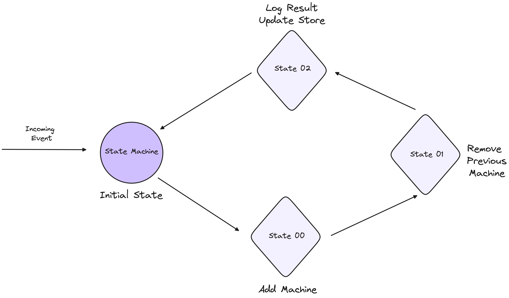
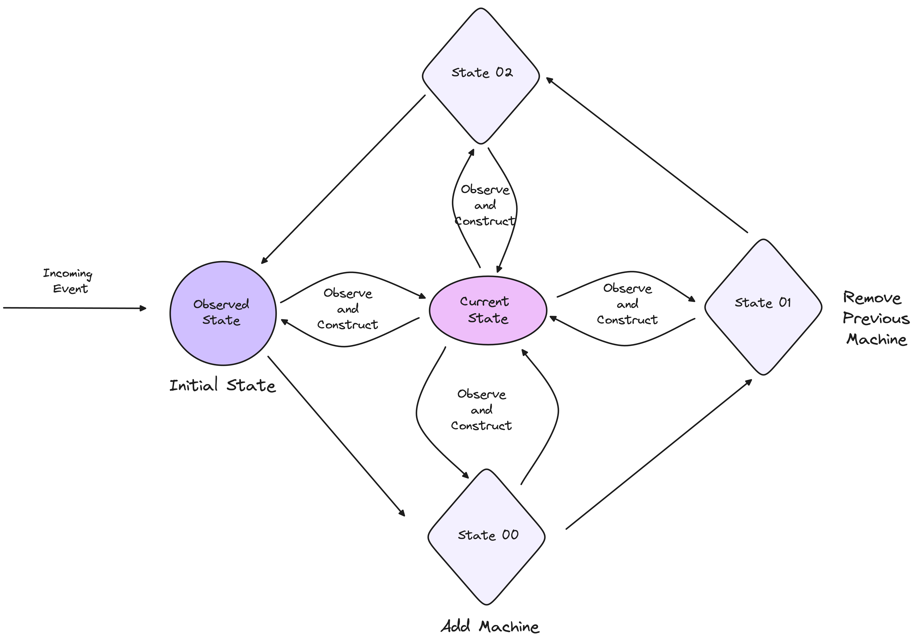

*The goal of this series is to provide an in-depth understanding of building state-driven infrastructure products, as opposed to API-driven ones. Much of the content is drawn from my experience building control planes for infrastructure. Before Kubernetes, I worked as an infrastructure developer on platforms like BOSH, Cloud Foundry, and Mesos. However, Kubernetes fundamentally changed my approach to state management and the construction of states.*

### Introduction to State Machines

A state machine is a behavior model that operates through a defined set of states, which is why it is often referred to as a finite-state machine (FSM). It operates based on its current state and specific inputs, which trigger state transitions and generate corresponding outputs.

At the core of a state machine are its two primary components: 
- States 
- Transitions. 

A state represents a particular condition or situation of a system, influenced by previous events, and it determines the actions taken in response to subsequent events. 

Transitions, on the other hand, define the movement from one state to another based on input conditions.

Let’s break it down with a simple example:

Imagine a scenario where your state machine needs to add a new machine and remove an existing one. To accomplish this, we can define the following states:

**Initial State:** This is the starting point, where the system is awaiting an event, such as the command to add a new machine.

**Transition State:** Once the event is received, the state machine moves to this intermediate state, where it handles the tasks of adding the new machine and preparing to remove the old one. During this state, various actions are executed to ensure a smooth transition.

**Final State:** After the new machine has been added and the old machine successfully removed, the state machine reaches this final state, where the system stabilises and awaits the next event.



------------------------------------------------------------------------------------
**1. States Definition**

```rust
// States
const INITIAL_STATE: &str = "Initial";
const ADDING_NEW_MACHINE_STATE: &str = "AddingNewMachine";
const DELETING_OLD_MACHINE_STATE: &str = "DeletingOldMachine";
const FINAL_STATE: &str = "Final";
```

**2. Event Handling and Transitions**

```rust
// Events
let mut current_state = INITIAL_STATE;

// Event: Start Process
if current_state == INITIAL_STATE {
    current_state = ADDING_NEW_MACHINE_STATE;
}

// Event: New Machine Added
if current_state == ADDING_NEW_MACHINE_STATE {
    // Do the action
    current_state = DELETING_OLD_MACHINE_STATE;
}

// Event: Old Machine Deleted
if current_state == DELETING_OLD_MACHINE_STATE {
    // Do the action
    current_state = FINAL_STATE;
}
```

**3. Actions**

```rust
// Action: Initialize System
fn initialize_system() {
    println!("System initialized.");
}

// Action: Add New Machine
fn add_new_machine() {
    println!("Adding new machine...");
    // Logic to add a new machine
}

// Action: Delete Old Machine
fn delete_old_machine() {
    println!("Deleting old machine...");
    // Logic to delete old machine
}

// Action: Finalize Process
fn finalize_process() {
    println!("Process complete.");
}
```

### Imperative Systems vs Declarative Systems

The above design primarily falls under the category of imperative systems, where users explicitly define the state transitions. In these systems, the user is not only aware of the desired state but also dictates the precise steps (or transitions) needed to reach that state. The control of the system lies heavily in the hands of the user, who manually defines each stage of the transition process.

Conversely, declarative systems shift the burden of managing transitions from the user to the system itself. While users are still aware of the desired state, they do not need to specify how to reach that state. The system observes the current state, compares it to the desired state, and autonomously constructs the necessary transitions to reconcile any differences. In this model, the system takes on the responsibility of state transitions, simplifying the user’s role to one of specifying outcomes rather than processes.


### Observed State

One key difference between the two paradigms is how they handle observed state. Nowhere in the Kubernetes documentation is there an explicit mention of controllers being state machines.

That’s because state machines are often rigid and predefined, making them less adaptable to dynamic environments. Kubernetes controllers, however, operate on a more flexible model, using conditions to drive their decision-making.


Controllers observe the current state of the system and use this observation to determine the next course of action. This is different from a strict state machine, which is built on a finite number of predetermined states and transitions. Kubernetes’ model allows controllers to adapt to unforeseen conditions and make decisions dynamically, based on the actual observed state.
 


### Conditions: Not State Machines

In Kubernetes, conditions are the backbone of how states communicate with each other. They are orthogonal in nature, meaning they exist independently of each other but work together to inform the system about its current state.

For example, a StatefulSet in Kubernetes may have a "Ready" condition, which indicates whether all pods are running and ready to serve traffic. These conditions are not part of a rigid state machine but are instead used by the controller to make decisions about the system’s next actions.

The flexibility provided by conditions allows the system to handle unintended states. When something unexpected occurs, the system doesn't fail outright but instead observes the conditions and attempts to reconcile the current state with the desired state. This adaptability is one of the most intriguing aspects of Kubernetes' architecture.

One potential misconception is that conditions should be used to build state machines. This, however, is not the intended purpose of conditions. The set of "Reasons" tied to conditions may evolve over time, and relying on a fixed set of enumerated conditions to represent states makes the system brittle and prone to breakage when these conditions change.

Conditions are not designed to define state transitions like state machines. Instead, their strength lies in providing insight into the current status of a system, especially when the state is complex or ongoing. By observing conditions, systems can infer the current state and respond accordingly, without the need for rigid state transitions.



### Events

Events represent discrete, point-in-time occurrences, while conditions represent the current state of an ongoing process.

For example:
Pod creation is an event, marking a specific moment when a Pod is created.
Deployment progressing is a condition, reflecting the ongoing state of the deployment process.


### Role of Events

Events are transient and provide a log of what has happened at a specific moment. They are highly valuable for tracking real-time occurrences in a system, particularly for debugging purposes or monitoring system behaviour over time. However, events alone are not sufficient for tracking long-running processes or understanding the current state of an object.

Events capture snapshots in time, and conditions offer deeper insight into current system states. The interplay between the two enhances system observability and user experience, making both tools indispensable for managing Kubernetes workloads.

Here’s an example of observed state

1. ***Observed State Definition***

```rust
// Observed States are inferred based on system conditions

fn get_observed_state() -> &'static str {
    if new_machine_exists() && old_machine_exists() {
        return "AddingNewMachine";
    } else if !new_machine_exists() && old_machine_exists() {
        return "DeletingOldMachine";
    } else if new_machine_exists() && !old_machine_exists() {
        return "Final";
    } else {
        return "Initial";
    }
}

```

2. ***Handling States (Condition-based State Observation)*** Instead of using events to trigger transitions, we observe the current state and perform actions accordingly.

```rust
fn handle_state() {
    let current_state = get_observed_state();
    
    match current_state {
        "Initial" => {
            println!("Current state: Initial. Preparing to add a new machine.");
            add_new_machine();
        }
        "AddingNewMachine" => {
            println!("New machine added. Preparing to delete the old machine.");
            delete_old_machine();
        }
        "DeletingOldMachine" => {
            println!("Old machine deleted. Process nearing completion.");
            finalize_process();
        }
        "Final" => {
            println!("System is in the final state. No further action required.");
        }
        _ => {
            println!("Unknown state.");
        }
    }
}
```

3. ***Actions*** The logic for each action remains similar but is now tied to the observed state instead of explicit event transitions.

```rust
// Action: Add New Machine
fn add_new_machine() {
    println!("Adding new machine...");
    // Logic to add a new machine
}

// Action: Delete Old Machine
fn delete_old_machine() {
    println!("Deleting old machine...");
    // Logic to delete old machine
}

// Action: Finalize Process
fn finalize_process() {
    println!("Process complete.");
}

```

4. ***Helper Functions*** These functions observe the system’s current state and return true or false to indicate whether certain machines exist. This helps in inferring the state.

```rust
// Helper functions to check if machines exist
fn new_machine_exists() -> bool {
    // Logic to determine if the new machine exists
    // For example, checking a database or an external system
    true
}

fn old_machine_exists() -> bool {
    // Logic to determine if the old machine exists
    true
}
```

### Summary

The article dives deep into how these concepts apply to building infrastructure products, comparing the rigid nature of state machines to the adaptability of an observed state system. Drawing from real-world experiences in control plane architecture and Kubernetes, it highlights the pros and cons of both models in managing the evolving state of complex systems.

If you are looking to build control planes and build state driven infra components, feel free to [contact us](https://cal.com/baazhq).
