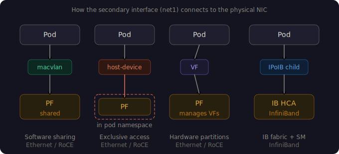
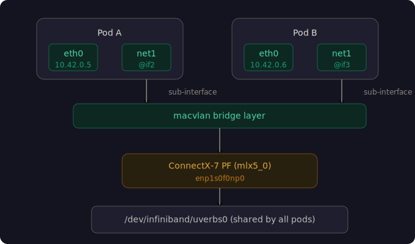
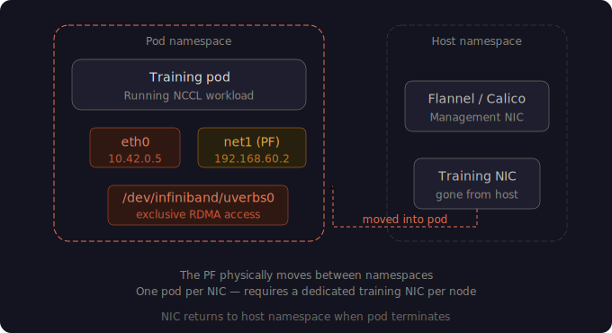
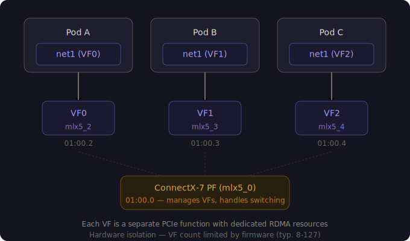
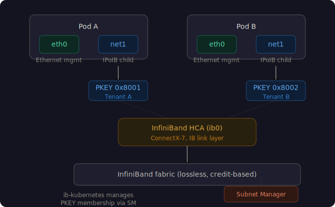

*Macvlan, host-device, SR-IOV, and IPoIB — what they are, how they differ, and when to use each for RDMA and NCCL traffic in GPU training clusters.*

<!-- truncate -->



## Why GPU pods need two networks

Every GPU training pod needs two distinct network paths. The management network is the standard Kubernetes pod network — Flannel, Calico, Cilium — carrying API traffic, health checks, metrics, and DNS. The training network is a dedicated, high-bandwidth path that carries NCCL collective operations (all-reduce, all-gather, broadcast) between GPUs across nodes.

Mixing both on a single interface doesn't work for serious GPU workloads. NCCL traffic is latency-sensitive and bandwidth-hungry. It needs to bypass kube-proxy, skip the overlay network, and in the case of RDMA, bypass the kernel entirely. The management network, by contrast, is low-bandwidth but needs reliable service discovery and DNS.

The Kubernetes-native way to give a pod two interfaces is Multus CNI. The primary CNI plugin provides `eth0` for management. Multus attaches a secondary interface (`net1`) backed by a physical RDMA-capable NIC, giving the pod direct access to the high-speed fabric.

The question is *how* that secondary interface gets attached to the physical NIC. There are four options, each with different isolation, performance, and complexity characteristics. These four options map directly to the four secondary network CRDs in the [NVIDIA Network Operator](https://github.com/Mellanox/network-operator), which automates deploying Multus, MOFED drivers, device plugins, and secondary network definitions across a cluster through a single `NicClusterPolicy` CR.

---

## Macvlan — shared access, software isolation



Macvlan is the simplest secondary network type. It creates a virtual sub-interface on top of a physical NIC. The host keeps the original interface, and each pod gets a new virtual interface with its own MAC address, backed by the same physical port. Multiple pods share the same NIC simultaneously.

At the kernel level, macvlan operates in `bridge` mode by default, which means macvlan sub-interfaces on the same host can communicate directly without hitting the physical wire. Traffic to external hosts goes through the PF (Physical Function) normally. Inside the pod, the secondary interface appears as `net1@ifN` — the `@ifN` suffix is the giveaway that it's a software sub-interface, not a real device.

Macvlan by itself only provides L2/L3 networking. To get RDMA, you pair it with the RDMA shared device plugin, which discovers RDMA-capable NICs on the host and exposes `/dev/infiniband/*` device files as Kubernetes extended resources. When a pod requests both the macvlan network and an RDMA resource, it gets a secondary interface *and* access to RDMA verbs.

The key detail: all pods on the same node share the same physical RDMA HCA. Each pod creates its own Queue Pairs on the PF, but the NIC hardware is not partitioned. Isolation is purely at the QP level in software.

In the Network Operator, you define a `MacvlanNetwork` CR specifying the master interface, mode, MTU, and IPAM configuration. The operator renders this into a Multus `NetworkAttachmentDefinition` automatically.

**When to use macvlan.** It's the right choice for POCs, development environments, or any setup where you need a quick dual-interface pod without fussing over firmware or operator complexity. It's also the only option when you have a single physical NIC port — macvlan can share the same port that carries your primary CNI overlay traffic. The tradeoff is no hardware isolation between pods. All pods talk through the same PF and share NIC resources.

---

## Host-device — exclusive access, the NIC moves into the pod



Host-device takes a fundamentally different approach. Instead of creating a virtual sub-interface, the `host-device` CNI plugin **moves the physical network interface itself** from the host's network namespace into the pod's network namespace. The NIC literally disappears from `ip link` on the host while the pod is running and reappears when the pod terminates.

This gives the pod exclusive, unshared access to the physical device. No other pod — and not even the host — can use that interface. Inside the pod, the secondary interface appears as a plain `net1` without the `@ifN` suffix, because it's not a virtual sub-interface. It's the real hardware.

Since the pod owns the entire physical device, it also owns the associated RDMA HCA. Every QP, every hardware flow table, every byte of NIC memory belongs to that one pod. This is the strongest isolation model short of giving a node to a single workload.

Like macvlan, host-device uses the RDMA shared device plugin to expose RDMA resources. The difference is entirely in the CNI plugin — `macvlan` creates a sub-interface, `host-device` moves the real device. In the Network Operator, a `HostDeviceNetwork` CR defines the secondary network, and the `resourceName` field links it to the device plugin's resource rather than naming a master interface directly.

**When to use host-device.** This is the production choice when each node has a dedicated NIC for training traffic. The standard GPU cluster topology is two NICs per node: one for Kubernetes management (backing Flannel/Calico), one for NCCL training (given entirely to the training pod via host-device). The pod gets the full NIC bandwidth and dedicated RDMA resources with zero contention.

The obvious limitation is that only one pod can use each NIC at a time. If you need multiple training pods per node sharing the same fabric, you need macvlan (software sharing) or SR-IOV (hardware partitioning). Host-device also doesn't work for secondary networks on single-NIC nodes — moving the only NIC into a pod kills the host's connectivity to the Kubernetes API server.

---

## SR-IOV — hardware-partitioned virtual functions



SR-IOV (Single Root I/O Virtualization) is a PCIe specification that lets a single physical NIC present itself as multiple independent virtual devices. The physical device is the Physical Function (PF). Each virtual device is a Virtual Function (VF). VFs are real PCIe functions — they show up in `lspci`, have their own driver bindings, their own MAC addresses, and their own RDMA contexts.

When a pod requests an SR-IOV VF, the SR-IOV CNI plugin moves that VF's netdev into the pod's network namespace — mechanically similar to host-device, but operating on a VF rather than the PF. The PF stays on the host, manages all VFs, and handles switching between them at line rate in NIC hardware.

This gives you the middle ground between macvlan and host-device: hardware-level isolation (each pod gets its own PCIe function with dedicated RDMA resources) combined with sharing (many pods use VFs carved from the same physical NIC). Each VF appears as its own `mlx5_X` RDMA device inside the pod, completely independent from other VFs and from the PF.

SR-IOV requires upfront configuration. The NIC firmware must have SR-IOV enabled (`SRIOV_EN=1` via `mlxconfig`), and VFs must be created on each node either manually through sysfs or automatically through the SR-IOV Network Operator. For Mellanox ConnectX NICs, VFs use native-bifurcating SR-IOV — they stay bound to the `mlx5_core` kernel driver and appear as regular netdevs. This is different from Intel NICs, which require VFs to be bound to `vfio-pci` for userspace access. Getting the `deviceType` right (netdevice for Mellanox, vfio-pci for Intel) is one of the most common SR-IOV configuration mistakes.

In the Network Operator, SR-IOV is managed through the embedded SR-IOV Network Operator (deployed as a Helm sub-chart). You define a `SriovNetworkNodePolicy` CR to specify which PFs to partition and how many VFs to create, and a `SriovNetwork` CR to define the secondary network. The operator handles VF creation, SR-IOV device plugin deployment, and `NetworkAttachmentDefinition` generation. Unlike macvlan and host-device, SR-IOV uses its own dedicated device plugin (`sriovDevicePlugin`) that discovers VFs specifically, rather than the shared RDMA device plugin that discovers PFs.

VF count is a hard firmware limit — ConnectX-7 supports up to 127 VFs per port, but each VF consumes NIC resources (queues, memory, steering rules). If you create 8 VFs and 9 pods need SR-IOV resources, the 9th pod stays `Pending`. This is different from the RDMA shared device plugin's `rdmaHcaMax`, which is a soft configuration limit.

**When to use SR-IOV.** It's the production choice for multi-tenant GPU clusters where multiple training jobs run on the same node and need hardware-isolated access to the RDMA fabric. Each pod gets its own VF with dedicated NIC resources, and the PF firmware handles switching at line rate. The cost is complexity: firmware configuration, operator deployment, and VF capacity planning.

---

## IPoIB — IP over InfiniBand



IPoIB is not the same thing as the other three. Macvlan, host-device, and SR-IOV all operate on Ethernet networks (including RoCE — RDMA over Converged Ethernet). IPoIB operates on a completely different link layer: InfiniBand.

InfiniBand is a lossless, credit-based fabric with its own L2 and L3 layers, managed by a Subnet Manager (SM) running on a managed switch or a dedicated node. Devices identify themselves by GUIDs and port GIDs rather than MAC addresses. Partitions (PKEYs) provide L2 isolation, analogous to VLANs on Ethernet but enforced at the fabric level.

IPoIB is a kernel module (`ib_ipoib`) that creates a standard IP network interface on top of InfiniBand transport. It encapsulates IP packets into InfiniBand messages so that normal TCP/UDP applications — health checks, monitoring agents, SSH — can communicate over the IB fabric without needing native RDMA verbs. The kernel interface appears as `ib0`, `ib1`, etc.

In Kubernetes, the IPoIB CNI plugin creates child IPoIB interfaces (sub-partitions) and moves them into pod network namespaces. Conceptually this is similar to macvlan — the host keeps the parent IPoIB interface, and pods get child interfaces backed by the same IB port — but the underlying mechanism uses IB partition keys rather than MAC-based sub-interfaces.

The Network Operator adds a component called ib-kubernetes for IPoIB deployments. It integrates with the InfiniBand Subnet Manager (typically NVIDIA UFM) to manage PKEY memberships for pods. When a pod joins an IPoIB network, ib-kubernetes ensures the pod's GUID is added to the correct partition in the SM and removes it on termination. This fabric-level tenant isolation is unique to InfiniBand — Ethernet has no equivalent.

An `IPoIBNetwork` CR in the Network Operator specifies the master IB interface and IPAM configuration. The operator deploys the IPoIB CNI plugin as part of the `secondaryNetwork` section in `NicClusterPolicy`.

For RDMA workloads on IB, the IPoIB interface is mainly for management-plane traffic. NCCL and other RDMA-aware applications bypass IPoIB entirely and use native IB verbs for GPU-to-GPU communication. Pods still need access to IB RDMA device files via the RDMA shared device plugin. If per-pod VF isolation is needed on InfiniBand, the `ib-sriov-cni` plugin handles SR-IOV VFs on IB interfaces — combining IB's native RDMA with SR-IOV's hardware partitioning.

**When IPoIB applies.** It's for clusters with InfiniBand fabric — typically national labs, large-scale HPC environments, and on-prem AI training clusters that use managed IB switches with a Subnet Manager. If your ConnectX NICs are running in Ethernet/RoCE mode — which covers most cloud, colo, and enterprise GPU clusters today — IPoIB is not relevant to your setup. DGX SuperPOD reference architectures historically used InfiniBand, though newer designs increasingly use RoCE with Spectrum-X switches.

---

## Choosing the right type

| | Macvlan | Host-device | SR-IOV | IPoIB |
|---|---|---|---|---|
| **Link layer** | Ethernet / RoCE | Ethernet / RoCE | Ethernet / RoCE | InfiniBand |
| **Isolation** | Software (shared QPs on PF) | Hardware (exclusive PF) | Hardware (dedicated VF per pod) | Software (shared IB port, PKEY isolation) |
| **NIC sharing** | Multiple pods per NIC | One pod per NIC | Multiple VFs per NIC | Multiple child interfaces per port |
| **RDMA device** | Shared PF (`mlx5_0`) | Exclusive PF (`mlx5_0`) | Dedicated VF (`mlx5_2`, `mlx5_3`…) | Shared IB HCA |
| **Complexity** | Low | Low | Medium (firmware, operator) | High (Subnet Manager, PKEYs) |
| **Firmware changes** | None | None | Required | None (SR-IOV on IB requires it) |
| **Device plugin** | RDMA shared | RDMA shared | SR-IOV device plugin | RDMA shared |

The decision usually comes down to two questions: what link layer is your high-speed fabric, and how many pods per node need access to it.

If your fabric is InfiniBand, IPoIB is your secondary network type and you add ib-kubernetes for partition management. Everything else assumes Ethernet/RoCE.

On Ethernet, if you have a dedicated training NIC per node and run one training pod at a time, host-device is the simplest path — exclusive NIC access with zero overhead. If multiple pods per node need hardware-isolated access to the same NIC, SR-IOV gives each pod its own VF with dedicated PCIe resources. If you don't need hardware isolation or you're running a quick POC on a single-NIC node, macvlan is the easiest starting point.

Macvlan and host-device use the same device plugin (RDMA shared device plugin) and differ only in the CNI — meaning you can switch between them by changing a single CRD. SR-IOV uses its own device plugin and requires firmware-level changes, so the switch is bigger. All four types can coexist in a single cluster through the Network Operator's `NicClusterPolicy`, and you can mix them — host-device for training pods, macvlan for monitoring sidecars — on the same set of nodes.

---

## How these map to the Network Operator

The NVIDIA Network Operator orchestrates all four types through a single `NicClusterPolicy` CR. Each sub-state in the policy corresponds to a component:

```
NicClusterPolicy
├── ofedDriver                    ← all types (MOFED driver container)
├── rdmaSharedDevicePlugin        ← macvlan, host-device, IPoIB
├── sriovDevicePlugin             ← SR-IOV
├── ibKubernetes                  ← IPoIB (PKEY management)
├── secondaryNetwork
│   ├── multus                    ← all types
│   ├── cniPlugins                ← all types (macvlan, host-device binaries)
│   └── ipoib                    ← IPoIB (ipoib CNI plugin)
└── sriovNetworkOperator (Helm)   ← SR-IOV (sub-chart)
```

Once the `NicClusterPolicy` is applied and healthy, you create the appropriate network CRD — `MacvlanNetwork`, `HostDeviceNetwork`, `IPoIBNetwork`, or `SriovNetworkNodePolicy` + `SriovNetwork` — and the operator generates the `NetworkAttachmentDefinition` that Multus needs. Pods reference it by name in their `k8s.v1.cni.cncf.io/networks` annotation and get their secondary interface on schedule.

The operator is not strictly required — for small clusters or POCs, you can deploy each component manually for full visibility into every layer. The operator earns its keep at scale, where managing MOFED driver versions, device plugin configs, and Multus across dozens of nodes by hand becomes a maintenance problem.

---

*For hands-on walkthroughs of these network types with working manifests, see our [GH200 dual-network RDMA guide](/blog/dual-network-rdma-kubernetes-gh200) (macvlan) and [SR-IOV POC guide](/blog/sriov-rdma-kubernetes-gh200) (SR-IOV).*

---

## Related

- [GPU Kubernetes Consulting →](/services/gpu-kubernetes)
- [GPU Networking & RDMA Consulting →](/services/gpu-networking)
- [Dual-Network RDMA on GH200 →](/blog/dual-network-rdma-kubernetes-gh200)
