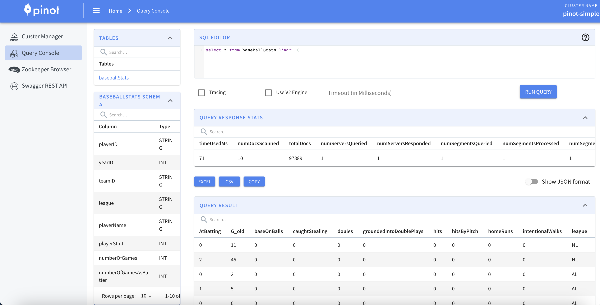
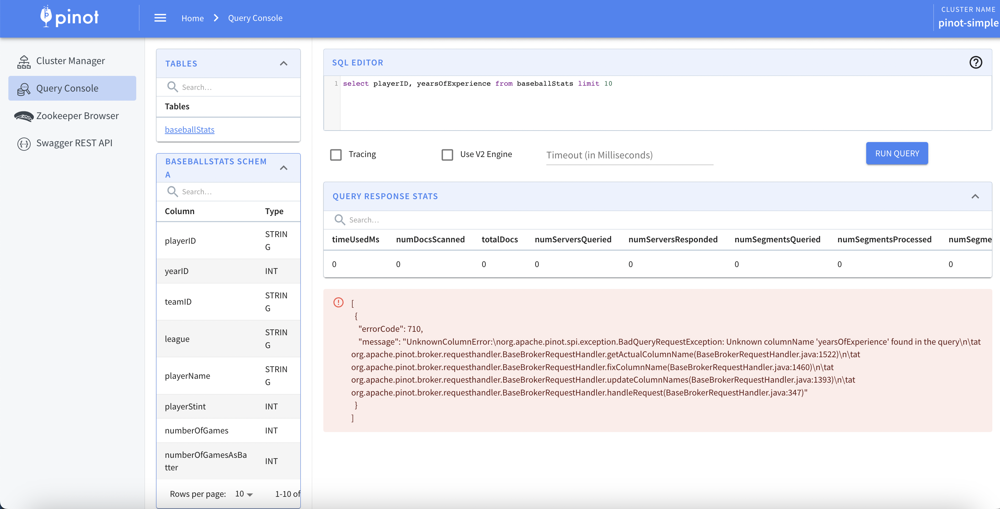
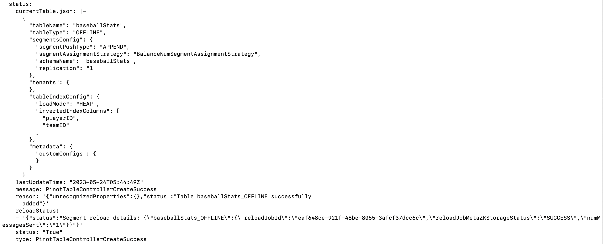
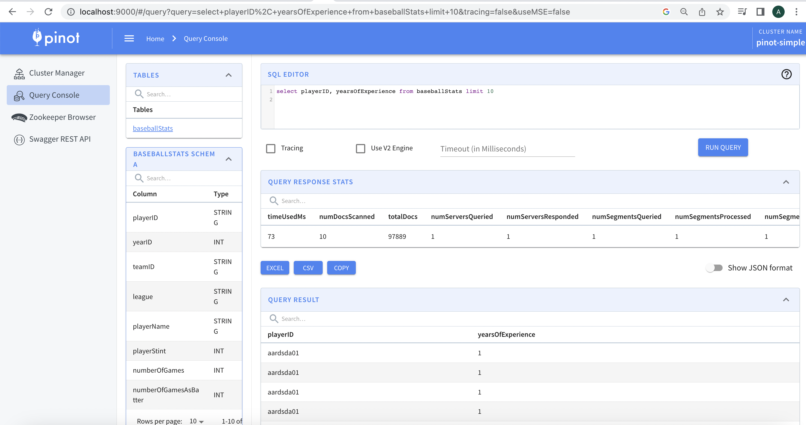

*In this exploration, we will dive deep into the [Pinot Control Plane](https://github.com/datainfrahq/pinot-control-plane-k8s) and its process of updating the Pinot schema and reloading segments based on state change on kubernetes*

# Introduction

In this tutorial, we will explore how the Pinot control plane handles the evolution of schemas by adding new columns, which in turn requires segment reloads. Before we delve into the details, let's establish some context: Kubernetes is not solely an orchestration platform; it serves as the control plane for our application, Pinot, in this case.

The Pinot control plane operates based on three key states: the original state, the desired state, and the current state. We will examine how it efficiently manages these states in an event-driven manner, enabling seamless schema updates and segment reloads


<!--truncate-->

## How Pinot Schema Controller detect's state change ?

Pinot Schema Controller is watches and reacts to custom resource with 

```
Group: datainfra.io
Version: v1beta1
Kind: PinotSchema
```

The Pinot control plane controllers detect state changes based on two triggers:

**Edge Driven Trigger**: Whenever there is a state change (CREATE/UPDATE/DELETE/PATCH) on the schema Custom Resource, a handler is immediately triggered. The event is then pushed down to a worker queue, dequeued, and reconciled by the reconciler.

**Level Driven Trigger**: The state is periodically checked at regular intervals. If the desired state does not match the current state, taking the original state into consideration, the event handler is triggered.

When a Pinot schema receives an UPDATE schema event, it constructs the state. The Pinot Schema Controller, while not strictly a state machine, constructs the state by retrieving the existing schema and checking for changes in the Pinot schema. If changes are detected, it proceeds to update the schema by invoking the Pinot Controller API for UPDATE schema.

## Pinot Table Controller: Predicate-Level Event Handling for Pinot Schema Changes

Pinot Table controller is responsible for watching and reconciling pinot table CR.

```
Group: datainfra.io
Version: v1beta1
Kind: PinotTable
```

The Pinot Table Controller possesses awareness of the Pinot schema associated with each table. It is designed to prevent Pinot schema event changes from being reconciled by the Pinot Table Controller itself. Instead, the Pinot Table Controller takes on the crucial role of watching the events and performing actions only for UPDATE events at the predicate level. By adopting this approach, the event is effectively intercepted and processed directly within the Pinot Table Predicate handler, eliminating the need to push it down to the worker queue. This streamlined event handling mechanism ensures efficient and targeted response within the distributed systems architecture of Pinot.

The pinot table controller initates the segment reloads and update the pinot table CR status with segment reload ID.

## Tutorial

- In this tutorial, we are going to deploy an Apache Pinot cluster on KIND.
- This tutorial can easily run on your local machine.
- Apache Pinot needs zookeeper for metadata management and is a dependency to run pinot.
- In this tutorial we shall install zookeeper using zookeeper-operator.

### Prerequisites

To follow this tutorial you will need:

- The KIND CLI installed.
- The KUBECTL CLI installed.
- Docker up and Running.


### Install Kind Cluster

Create kind cluster on your machine.

<TerminalWindow>

```
kind create cluster --name pinot
```

</TerminalWindow>


### Installing Pinot Control Plane

Pinot control plane supports Helm Chart-based deployment.

Clone the repo:

<TerminalWindow>

```
git clone https://github.com/datainfrahq/pinot-control-plane-k8s.git
cd pinot-control-plane-k8s/
```

</TerminalWindow>


### Deploy Pinot Control Plane

The following commands deploys the control plane using helm in the pinot-control-plane namespace.

<TerminalWindow>

```
helm repo add datainfra https://charts.datainfra.io

helm upgrade --install \
--namespace pinot-control-plane \
--create-namespace \
pinot-control-plane datainfra/pinot-control-plane
```

</TerminalWindow>

### Deploy Zookeeper Operator and Zookeeper

The following command will take a few minutes to complete. It will deploy the zookeeper operator in the zookeeper-operator namespace and zk statefulset in the pinot namespace.

<TerminalWindow>

```
make helm-install-zk-operator
```

</TerminalWindow>


### Installing Pinot Cluster

- Install Pinot Cluster CR.

<TerminalWindow>

```
kubectl apply -f tutorials/06-pinot-schema-evolution/pinot-simple.yaml -n pinot
```

</TerminalWindow>

### Create Pinot Schema 

- Create Pinot Schema CR.

:::info
Make sure pinot cluster is up and running, and console is accessible.
```
kubectl port-forward svc/pinot-controller-controller-svc 9000 -n pinot
```
:::

<TerminalWindow>

```
kubectl apply -f tutorials/06-pinot-schema-evolution/pinotschema-simple.yaml -n pinot
```

</TerminalWindow>

:::tip
Run ```kubectl get pinotschema -n pinot -o yaml``` and check the status
to know what the current state of the pinot schema is.
:::

### Create Pinot Table 


<TerminalWindow>

```
kubectl apply -f tutorials/06-pinot-schema-evolution/pinottable-simple.yaml -n pinot
```

</TerminalWindow>

:::tip
Run ```kubectl get pinottable -n pinot -o yaml``` and check the status
to know what the current state of the pinot schema is.
:::

### Ingest Data Into Pinot 

We will execute a kubernetes job and load data from a configmap mounted within the pod.

<TerminalWindow>

```
kubectl apply -f tutorials/06-pinot-schema-evolution/pinot-ingestionjob.yaml -n pinot
```

</TerminalWindow>

### Run Query

Here we exepect the query to run and exepct a 200 response.

:::info
make sure the above job executed as ```completed```
```
pinot-baseballstat-job-qq9br    0/1     Completed   0          27m
```
:::

```
select * from baseballStats limit 10
```



Let's run a query a column ```yearsOfExperience```, we expect this to fail as column does not exist.

```
select playerID, yearsOfExperience from baseballStats limit 10
```



### Add column to Schema - Update Schema 

Lets now update the schema with a new event.

<TerminalWindow>

```
kubectl apply -f tutorials/06-pinot-schema-evolution/pinotschemaupdate-simple.yaml  -n pinot
```

</TerminalWindow>


### Check Pinot Table CR Status

The table controller udpates the custom resource status with Segment reload details.



### Run query 

Here we exepect the query to run and exepct a 200 response.

```
select playerID, yearsOfExperience from baseballStats limit 10
```


