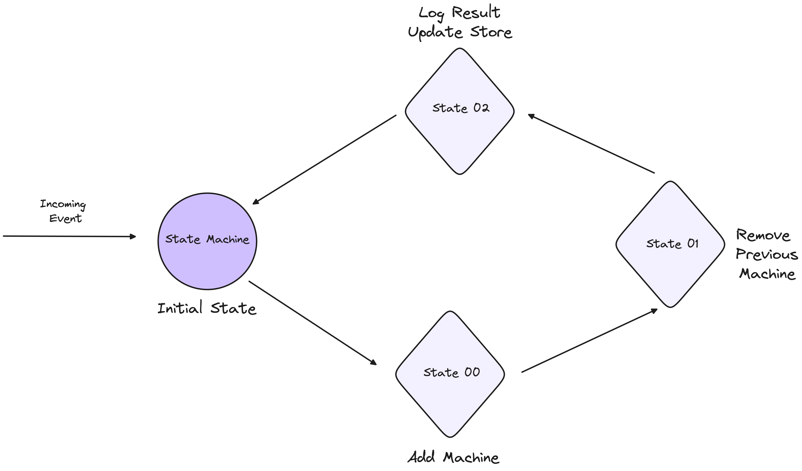

*The goal of this series is to provide an in-depth understanding of building state-driven infrastructure products, as opposed to API-driven ones. Much of the content is drawn from my experience building control planes for infrastructure. Before Kubernetes, I worked as an infrastructure developer on platforms like BOSH, Cloud Foundry, and Mesos. However, Kubernetes fundamentally changed my approach to state management and the construction of state machines.*

# Introduction to State Machines

A state machine is a behavior model that operates through a defined set of states, which is why it is often referred to as a finite-state machine (FSM). It operates based on its current state and specific inputs, which trigger state transitions and generate corresponding outputs.

At the core of a state machine are its two primary components: 
- States 
- Transitions. 

A state represents a particular condition or situation of a system, influenced by previous events, and it determines the actions taken in response to subsequent events. 

Transitions, on the other hand, define the movement from one state to another based on input conditions.

Let’s break it down with a simple example:

Imagine a scenario where your state machine needs to add a new machine and remove an existing one. To accomplish this, we can define the following states:

**Initial State:** This is the starting point, where the system is awaiting an event, such as the command to add a new machine.

**Transition State:** Once the event is received, the state machine moves to this intermediate state, where it handles the tasks of adding the new machine and preparing to remove the old one. During this state, various actions are executed to ensure a smooth transition.

**Final State:** After the new machine has been added and the old machine successfully removed, the state machine reaches this final state, where the system stabilises and awaits the next event.



**1. States Definition**

```rust
// States
INITIAL_STATE = "Initial"
ADDING_NEW_MACHINE_STATE = "AddingNewMachine"
DELETING_OLD_MACHINE_STATE = "DeletingOldMachine"
FINAL_STATE = "Final"
```

**2. Event Handling and Transitions**

```rust
// States
// Event: Start Process
event START_PROCESS = (currentState == INITIAL_STATE)

// Event: New Machine Added
event NEW_MACHINE_ADDED = (currentState == ADDING_NEW_MACHINE_STATE)

// Event: Old Machine Deleted
event OLD_MACHINE_DELETED = (currentState == DELETING_OLD_MACHINE_STATE)
```

**3. Transitions**

```rust
// Transition from Initial to AddingNewMachine
transition INITIAL_TO_ADDING_NEW_MACHINE = (event == START_PROCESS) ? ADDING_NEW_MACHINE_STATE : currentState

// Transition from AddingNewMachine to DeletingOldMachine
transition ADDING_NEW_MACHINE_TO_DELETING_OLD_MACHINE = (event == NEW_MACHINE_ADDED) ? DELETING_OLD_MACHINE_STATE : currentState

// Transition from DeletingOldMachine to Final
transition DELETING_OLD_MACHINE_TO_FINAL = (event == OLD_MACHINE_DELETED) ? FINAL_STATE : currentState
```

**4. Actions**

```rust
// Action: Initialize System
action Initialize() {
    log("System initialized.")
}

// Action: Add New Machine
action AddNewMachine() {
    log("Adding new machine...")
    // Code to add new machine
    event = NEW_MACHINE_ADDED // Trigger event
}

// Action: Delete Old Machine
action DeleteOldMachine() {
    log("Deleting old machine...")
    // Code to delete old machine
    event = OLD_MACHINE_DELETED // Trigger event
}

// Action: Finalize Process
action FinalizeProcess() {
    log("Process complete.")
}
```

While the above state machine implementation effectively models a sequence of operations—adding a new machine and deleting an old one—it's built on hardcoded states and transitions. This approach has some inherent limitations that can affect flexibility, scalability, and robustness, particularly in dynamic and complex environments.


# Introduction to Events in State Machines

Events in state machines serve as historical records, primarily for human interpretation rather than machine consumption.

In state machines, events are the key triggers that drive state transitions. They represent specific occurrences or actions that prompt the state machine to evaluate its current state and transition to the next state based on predefined rules.


**Triggering State Transitions:**

Events initiate transitions between states. For example, an event like ```NewMachineAdd``` would trigger the state machine to move from ```AddingNewMachine``` to ```DeletingOldMachine```.

**Decision Making:**

Upon receiving an event, the state machine evaluates conditions and determines the appropriate next state. This allows the system to respond dynamically based on the event's context.

**Events as Milestones:**

Certain events, like ```OldMachineDeleted```, act as indicators of task completion, allowing the state machine to progress to a stable state.